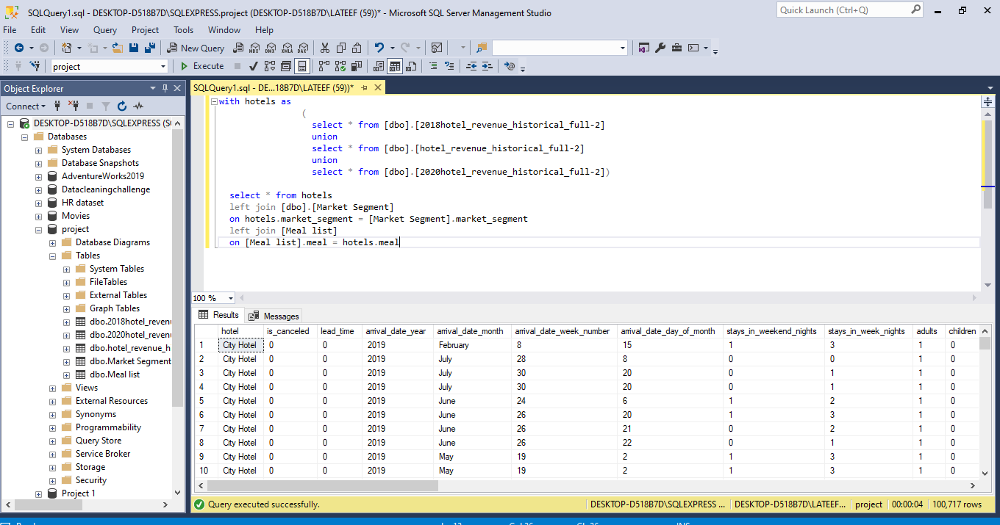
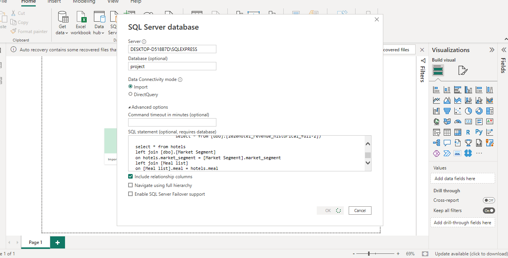

# Hotel Inventory Analysis

## Introduction

This is a SQL and power BI project on inventory analysis of an imagerinary hotel called **SLG**.
The project is to analyze and derive insights to answer crucial questions and help the store make data driven decions. The process was achieved using SQL for data wrangling and exploration, and Power BI for visualization

**_Disclaimer_** : _All dataset and reports do not represent any company, institution or country, but just a dummy dataset gotten online to demonstate the capabilities of MySQL and Power BI._

## Problem Statement 
Q1. "Is our hotel revenue growing by year?"

Q2. We have two hotel types so it would be good to segment
revenue by hotel type.

Q3. Should we increase our parking lot size?

**P.S** We want to understand if there is a trend is quest with personal
cars.
"What trends can we see in
the data?"
Focus on average daily rate and
quests to explore seasonality.

## Skills / Concept demonstrated

The following Power Bi features were incoporated: 
- DAX
- Quick Measure
- Data Wangling
- Data Exploration
- Modelling

## Data Wangling 
## - Some qeries were written to answer the questions above uaing MYsql

## - The queires were extracted in tables into powerbi for visualization.

## Visualization

.jpg)

You can interact with the report here: [https://bit.ly/SLGHotel]

The revenue trend indicates a consistent and significant growth over the years? Which is positive sign for the business. This growth suggests that the company is performing week and attracting more customers. However, in order to sustain this growth and further increase revenue. It is criticism for the business to identify and address any existing loopholes or potential areas for
Improvement. 

While the revenue growth is promising, the data regrading the percentage growth of cars parked does not show a significant increase. This implies that the current parking capacity is sufficient to acvomoyghe vurrrng customer base. Therefore expanding the parking lots may not be necessary at this point in time. It would be advisable to focus on maintaining the existing parking space efficiently ensuring convenience for customers without inviting unnecessary body for expansion 

In todays digital age having a user-friendly online platform is crucial for any bizness to enhance the user experience. The organization should prioritize the development of an intuitive and easy-go-navigate website or mobile app. This would allow customers to explore the company’s offerinheZ make reservations, and engage with the business more conveniently. In addition to improving the online platform, the company should also focus on promoting their services through both digital and traditional marketing channels. Utilizing digital marketing strategies such as search engine optimization (SEO), social media marketing, and online advertising can help increase brand visibility and reach a wider audience simultaneously, traditional marketing channels such as print media, bill boards, or radio can still play a role in reaching potential customers who may not be active online. 
By investing in a user-friendly online platform and implementing a comprehensive marketing strategy that combines digital and traditional channels, the business can maximize its potential for growth and attract new customers while retaining existing ones.

THANK YOU 😄

Chat me up on Linkedln: http://linkedin.com/in/salau-gideon-ond-aat-bsc-and-aca-in-view-330a4a1a0

Twitter: @LateefGideon

Whatsapp: 08100657265

